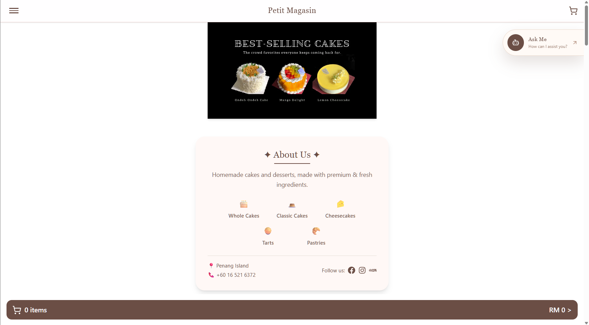
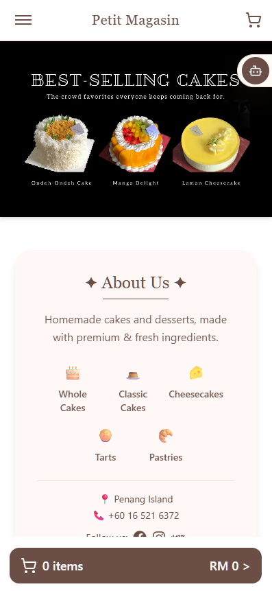
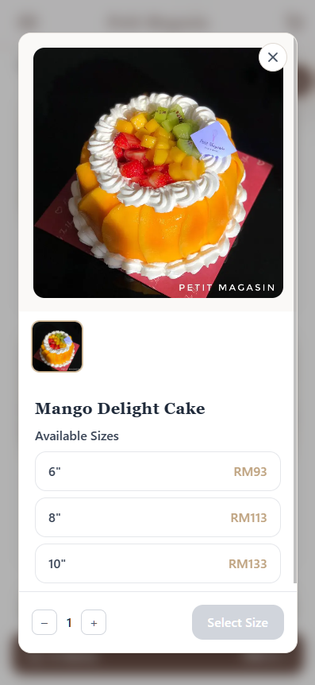
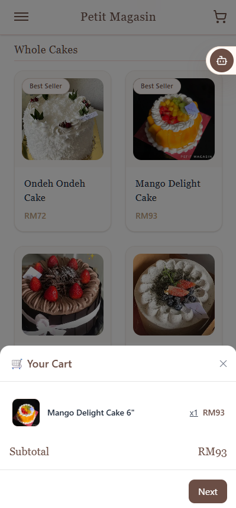
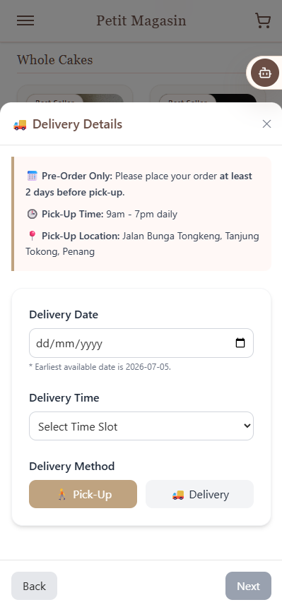
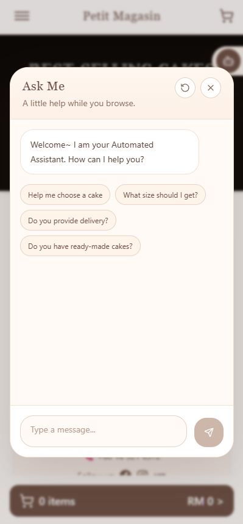

# Online Ordering Platform

## Demo

- [Click for Live Demo](https://petitmagasin-demo.vercel.app/)
- [Click for Demo Video](./assets/demo.mp4)

## Project Overview

This project is a full-stack online ordering platform designed for small online food businesses. It helps merchants showcase products in a structured and user-friendly way, while making it easier for customers to browse, select products, and place orders.

The platform supports category-based product browsing, product option configuration, cart management, AI-assisted customer support, and WhatsApp order confirmation. It streamlines the ordering process by collecting order details before handing off the final confirmation through WhatsApp.

## My Role

- Designed the product flow and developed the storefront, product configuration, cart, and checkout modal.
- Built the AI customer-service and product-recommendation workflows.
- Integrated WhatsApp order handoff and supporting API routes.
- Deployed and maintained the application on Vercel.

**Tech stack:** Next.js, React, TypeScript, Tailwind CSS, LangChain, Vercel.

## Project Background

Small online food businesses often promote and sell their products across multiple social media and messaging platforms, such as Facebook, Instagram, and WhatsApp. However, this workflow can become inefficient when merchants need to respond to customer enquiries across different apps, especially when many customers are mainly looking for the menu, placing orders, or asking similar questions about product options, prices, availability, pickup, and delivery.

This online ordering platform centralises the product menu, customer enquiries, and order detail collection into one guided ordering flow, while retaining WhatsApp as the merchant’s familiar channel for final order confirmation.

## Core Features

- Responsive product catalogue and category navigation
- Product images, variants, options, quantities, and dynamic pricing
- Cart management and order checkout
- Pickup, delivery, address, time-slot, and delivery-fee handling
- Structured WhatsApp order generation
- AI assistant with shop-specific FAQ knowledge and product recommendation

## Project Screenshots

### Storefront

  
   
  

### Product Configuration

  

### Cart and Delivery

  
  &nbsp;&nbsp;
  

### AI Assistant Chatbot

  

